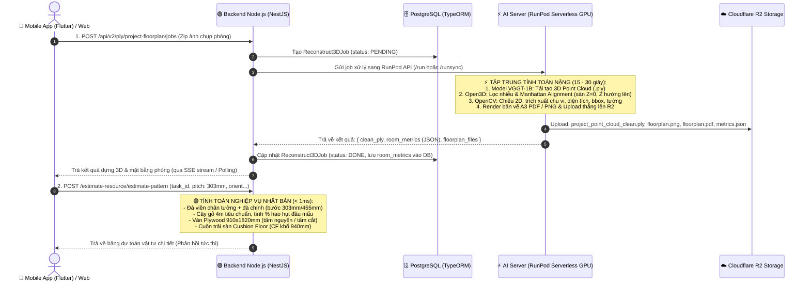

# TÀI LIỆU CẬP NHẬT KIẾN TRÚC HỆ THỐNG: AI SERVER & BACKEND NODE.JS

Tài liệu này mô tả chi tiết kiến trúc phân tách trách nhiệm (*Separation of Concerns*) giữa **AI Server (GPU trên RunPod / `test-docker`)** và **Backend Node.js (NestJS `UT-3D-Lidar-BE`)** sau khi hoàn thành tích hợp và tối ưu hóa hệ thống.

---

## 🎯 TỔNG QUAN: VAI TRÒ CỐT LÕI CỦA 2 THÀNH PHẦN

| Thành phần | Vai trò cốt lõi | Lý do phân định |
| :--- | :--- | :--- |
| **⚡ AI Server**<br/>*(RunPod GPU / Docker)* | **Thị giác máy tính & Tái tạo 3D (3D Computer Vision & Deep Learning)**<br/>Chỉ tập trung vào việc biến ảnh chụp thành không gian 3D, căn phẳng hệ trục tọa độ, đo đạc kích thước thực tế căn phòng và xuất bản vẽ CAD. | Các thư viện Open3D, OpenCV, PyTorch yêu cầu GPU/C++ runtime và tính toán ma trận nặng. Xử lý tập trung tại đây tận dụng được ngay dữ liệu Point Cloud đang có sẵn trong bộ nhớ. |
| **🟢 Backend Node.js**<br/>*(NestJS `UT-3D-Lidar-BE`)* | **Trung tâm điều phối (API Gateway) & Nghiệp vụ dự toán (Business Logic)**<br/>Quản lý người dùng, điều phối tiến độ quét 3D, lưu trữ dữ liệu, và **tính toán vật tư đà gỗ/ván sàn theo chuẩn xây dựng Nhật Bản**. | Node.js nhẹ, I/O bất đồng bộ cực tốt, phục vụ hàng ngàn người dùng 24/7 với chi phí rẻ. Xử lý các bài toán số học dự toán vật tư trong < 1ms mà không cần chạm vào file 3D nặng. |

---

## 🏗️ 1. Sơ Đồ Kiến Trúc & Luồng Dữ Liệu (End-to-End Pipeline)



---

## ⚡ 2. VAI TRÒ CỦA AI SERVER HIỆN TẠI (RunPod GPU / `test-docker`)

### 🎯 Trách nhiệm duy nhất:
AI Server chịu trách nhiệm toàn bộ các tác vụ tính toán nặng về **Trí tuệ nhân tạo (Deep Learning)** và **Thị giác máy tính 3D (3D Computer Vision)**, từ lúc nhận ảnh thô đến khi trích xuất ra kích thước căn phòng (`room_metrics`).

### ⚙️ Môi trường & Công nghệ:
- **Tài nguyên**: GPU chuyên dụng (NVIDIA L4 / A40 / RTX 4090, VRAM 16GB - 24GB).
- **Mô hình hoạt động**: Serverless Worker (chỉ khởi động tính tiền khi có job, xử lý xong trong **15 - 30 giây** rồi giải phóng tài nguyên).
- **Tech Stack**: Python 3.10+, PyTorch, CUDA, `facebook/VGGT-1B-Commercial`, Open3D, OpenCV (`opencv-python-headless`), NumPy, SciPy, Matplotlib, Shapely.

### 📋 6 Bước xử lý tự động khép kín trên AI Server:
1. **Tái tạo 3D (VGGT-1B)**: 
   - Nhận ảnh chụp căn phòng $\to$ chạy mô hình VGGT để trích xuất đám mây điểm 3D dạng tensor $\to$ ghi file `project_point_cloud.ply`.
2. **Lọc sạch dữ liệu (Open3D Clean)**: 
   - Voxel downsampling và Statistical Outlier Removal (`clean_ply_file`) để loại bỏ các điểm nhiễu, điểm trôi nổi ngoài không gian.
3. **Căn chỉnh hệ trục Manhattan (Open3D + SVD/RANSAC)**: 
   - Dò tìm mặt phẳng sàn thực tế bằng RANSAC.
   - Xoay hệ trục tọa độ không gian sao cho: **Mặt sàn nằm phẳng chuẩn tại $Z = 0$**, trục $Z$ hướng thẳng đứng lên trần.
   - Phân tích góc xoay yaw (PCA) để xoay các bức tường chính vuông góc song song với trục $X$ và $Y$.
4. **Chiếu 3D xuống 2D & Trích xuất viền phòng (OpenCV)**:
   - Chiếu đám mây điểm đã căn phẳng xuống mặt 2D ($X, Y$).
   - Lọc nhiễu profile trim và rasterization thành occupancy grid.
   - Thuật toán nhận diện đa giác phòng (`cv2.findContours` và Douglas-Peucker `approxPolyDP`) và xử lý góc khuyết chữ L (`fit_missing_corner_l_shape`).
5. **Đo đạc hình học căn phòng (`room_metrics`)**:
   - `height_mm`: Chiều cao trần nhà (khoảng cách trục $Z$ từ sàn lên trần).
   - `area_m2`: Diện tích mặt sàn thực tế.
   - `perimeter_m`: Chu vi phòng (tổng chiều dài các cạnh viền tường).
   - `bbox_width_mm` & `bbox_depth_mm`: Kích thước hình hộp chữ nhật bao ngoài phòng.
   - `vertices_mm`: Tọa độ các đỉnh góc phòng theo milimét (dạng `[[x1, y1], [x2, y2], ...]`).
   - `walls`: Danh sách chi tiết từng bức tường (mã tường $W_1, W_2...$, hướng tường Hor/Ver, chiều dài mm, diện tích $m^2$).
6. **Render bản vẽ kỹ thuật CAD & Upload Cloudflare R2**:
   - Tự động vẽ bản vẽ kỹ thuật khổ tiêu chuẩn A3: `floorplan.png`, `floorplan.pdf`, `walls.png`.
   - Upload toàn bộ artifacts lên Cloudflare R2 và sinh Presigned URLs.

> **💡 Điều AI Server KHÔNG làm:**
> - AI Server **không** xử lý logic nghiệp vụ đà gỗ, ván sàn hay giá thành vật tư.
> - AI Server chỉ tập trung làm tốt nhất nhiệm vụ: **Ảnh $\to$ 3D Model $\to$ Kích thước phòng thực tế & Bản vẽ CAD**.

---

## 🟢 3. VAI TRÒ CỦA BACKEND NODE.JS HIỆN TẠI (NestJS `UT-3D-Lidar-BE`)

### 🎯 Trách nhiệm duy nhất:
Backend Node.js đóng vai trò là **Bộ não trung tâm điều phối (API Gateway)**, quản lý người dùng, quản trị dữ liệu và thực thi toàn bộ **Nghiệp vụ tính toán dự toán vật tư thi công sàn theo tiêu chuẩn Nhật Bản**.

### ⚙️ Môi trường & Công nghệ:
- **Tài nguyên**: Máy chủ CPU thông thường (VPS / Cloud Container: 2 vCPU, 4GB RAM), chạy liên tục 24/7 với chi phí rất thấp.
- **Tech Stack**: NestJS (TypeScript), TypeORM, PostgreSQL, RxJS (Server-Sent Events), Math JS thuần túy.
- **Ưu điểm kiến trúc**: **Hoàn toàn không cần Open3D, không cần OpenCV, không cần tải file PLY 50-100MB về máy chủ**.

### 📋 2 Module cốt lõi và nhiệm vụ chi tiết:

#### 1. Module `3d_reconstruct` (Điều phối & Đồng bộ dữ liệu AI):
- Cung cấp các API RESTful cho Mobile App / Web Client:
  - `POST /api/v2/ply/project-floorplan/jobs`: Tiếp nhận file ảnh, tạo Job trong Database và kích hoạt RunPod AI Server.
  - `GET /api/v2/ply/jobs/:job_id`: Cho phép App polling kiểm tra tiến độ.
  - `GET /api/v2/ply/jobs/:job_id/events`: Server-Sent Events (SSE) đẩy tiến độ thời gian thực về cho App.
- **Tiếp nhận kết quả từ AI Server**:
  - Khi RunPod hoàn tất, hàm `pollPlyJob()` bóc tách `output.room_metrics` (JSON nhỏ gọn vài KB) và `output.floorplan_files`.
  - Lưu trữ kết quả vĩnh viễn vào bảng `reconstruct_3d_jobs` trong PostgreSQL và lưu vào bộ nhớ đệm `Reconstruct3DService.jobCache` theo `jobId` và `rawTaskId`.

#### 2. Module `estimate_resource` (Dự toán vật tư chuẩn Nhật Bản):
Toàn bộ logic tính toán vật liệu xây dựng được thực thi bằng **các thuật toán số học thuần túy trên Node.js với thời gian phản hồi siêu tốc (< 1 mili-giây)**:

- **Tự động liên kết kích thước phòng (`resolveRoomDimensions`)**:
  - Tự động lấy kích thước phòng thực tế (`bbox_width_mm`, `bbox_depth_mm`, `area_m2`, `perimeter_m`, `height_mm`) từ `task_id` của lượt quét 3D trước đó.
  - Cho phép người dùng ghi đè kích thước nếu muốn thử nghiệm kịch bản khác.
- **Dự toán thanh đà gỗ sàn (根太 - Wood Joists / Battens - `calculateJapaneseWoodJoists`)**:
  - **Thanh viền chân tường (Border battens)**: Tính chu vi viền quanh chân tường ($2 \times (L + W)$).
  - **Thanh đà chính bên trong (Inner joists)**: Rải song song cách đều theo bước đà chuẩn Nhật (pitch = 303mm hoặc 455mm) theo chiều ngang hoặc dọc.
  - **Quy đổi số cây gỗ tiêu chuẩn cần mua**: Lấy tổng mét dài gỗ (cộng 5% hao hụt tiêu chuẩn) chia cho độ dài cây gỗ chuẩn Nhật (`4.0m`/cây hoặc `3.0m`/cây) để ra số cây chẵn cần mua thực tế.
  - **Tỉ lệ hao hụt (% waste)**: Tính toán chính xác phần trăm gỗ thừa cắt đầu mẩu.
- **Dự toán ván sàn Plywood tiêu chuẩn 910x1820mm (`calculateJapanesePlywood`)**:
  - Mô phỏng đặt ván theo 2 hướng (dọc / ngang).
  - Đếm số tấm nguyên vẹn (`full_boards`) và số tấm cần cưa cắt (`cut_boards`).
  - Tự động chọn hướng lát tối ưu (`best_option`) để giảm thiểu số tấm cần đặt mua.
- **Dự toán cuộn trải sàn Cushion Floor (CF khổ 940mm - `calculateJapaneseCF`)**:
  - Tính số dải trải sàn, tổng mét dài cuộn cần cắt, diện tích hao hụt theo khổ cuộn chuẩn 940mm.
- **Dự toán ốp lát gạch sàn (`estimateTiling`)**:
  - Tính số viên gạch theo kích thước và ron chỉ, diện tích mua thực tế, lượng keo dán gạch và bột chà ron.
- **Tùy chỉnh & Cập nhật kích thước (`updatePlyDimensions`)**:
  - Cho phép thợ/kỹ sư điều chỉnh lại chiều dài tường hoặc chiều cao trần sau khi đo đạc lại ngoài công trường, tự động cập nhật cache để các lượt tính tiếp theo áp dụng ngay.

---

## ⚖️ 4. BẢNG SO SÁNH CHI TIẾT TRÁCH NHIỆM

| Tiêu chí | ⚡ AI Server (RunPod GPU) | 🟢 Backend Node.js (`UT-3D-Lidar-BE`) |
| :--- | :--- | :--- |
| **Nhiệm vụ chính** | Tái tạo 3D Point Cloud từ ảnh, xoay trục Manhattan, trích xuất viền 2D và đo kích thước phòng, xuất bản vẽ CAD A3 | Quản lý User/Auth, điều phối Job, lưu Database, tính toán số học dự toán vật tư (gỗ, ván, CF, gạch) chuẩn Nhật |
| **Dữ liệu đầu vào** | File ZIP chứa các ảnh chụp phòng đa góc | `task_id` (mã lượt scan), thông số đà gỗ (`pitch_mm`, `batten_width_mm`, hướng lát) |
| **Dữ liệu đầu ra** | File `.ply`, `room_metrics` (JSON vài KB), ảnh/PDF bản vẽ CAD | Bảng thống kê chi tiết vật tư (số cây gỗ 4m, tấm plywood, mét cuộn CF, tỉ lệ hao hụt) |
| **Thời gian thực thi** | 15 – 30 giây / lượt scan phòng | **< 1 mili-giây (0.001s)** cho mỗi lượt tính toán vật tư |
| **Yêu cầu phần cứng** | GPU khủng (16GB - 24GB VRAM như RTX 4090 / L4 / A40) | CPU thông thường (2 vCPU, 4GB RAM) |
| **Mô hình triển khai** | Serverless Worker (chỉ bật khi có yêu cầu quét phòng) | Service chạy 24/7 (VPS / ECS / K8s chi phí rẻ) |
| **Thư viện sử dụng** | PyTorch, VGGT-1B, Open3D, OpenCV, SciPy, Matplotlib | NestJS, TypeORM, Class-Validator, RxJS, Math JS |

---

## 🔄 5. CHUẨN DỮ LIỆU TRAO ĐỔI (DATA CONTRACT)

### 📤 1. AI Server hoàn thành và trả về cho Node.js:
*(Gồm URL file 3D, bộ thông số hình học `room_metrics` và URL bản vẽ)*
```json
{
  "status": "success",
  "job_id": "8a1b2c3d",
  "clean_ply": {
    "presigned_url": "https://r2.yourdomain.com/.../project_point_cloud_clean.ply",
    "r2_key": "ply_clean/batch/8a1b2c3d/project_point_cloud_clean.ply"
  },
  "room_metrics": {
    "height_mm": 2450.0,
    "area_m2": 15.12,
    "perimeter_m": 15.6,
    "bbox_width_mm": 4200.0,
    "bbox_depth_mm": 3600.0,
    "shape_name": "Rectangle",
    "wall_count": 4,
    "vertices_mm": [
      [0.0, 0.0],
      [4200.0, 0.0],
      [4200.0, 3600.0],
      [0.0, 3600.0]
    ],
    "walls": [
      { "id": "W1", "direction": "Hor", "length_mm": 4200.0, "area_m2": 10.29 },
      { "id": "W2", "direction": "Ver", "length_mm": 3600.0, "area_m2": 8.82 },
      { "id": "W3", "direction": "Hor", "length_mm": 4200.0, "area_m2": 10.29 },
      { "id": "W4", "direction": "Ver", "length_mm": 3600.0, "area_m2": 8.82 }
    ]
  },
  "floorplan_files": {
    "floorplan_png": { "presigned_url": "https://r2.../floorplan.png" },
    "floorplan_pdf": { "presigned_url": "https://r2.../floorplan.pdf" },
    "metrics_json": { "presigned_url": "https://r2.../metrics.json" }
  }
}
```

### 📥 2. Node.js tính toán vật tư và trả về cho Mobile App Flutter:
`POST /estimate-resource/estimate-pattern` *(Thời gian đáp ứng < 1ms)*
```json
{
  "status": "success",
  "task_id": "ply:8a1b2c3d",
  "source": "runpod_cached_scan",
  "room_dimensions": {
    "length_mm": 4200,
    "width_mm": 3600,
    "height_mm": 2450,
    "floor_area_m2": 15.12,
    "perimeter_m": 15.6
  },
  "summary": {
    "orientation": "horizontal",
    "floor_area_m2": 15.12,
    "batten_width_mm": 30,
    "batten_spacing_mm": 303,
    "standard_piece_length_m": 4.0,
    "border_battens_m": 15.6,
    "inner_battens_count": 11,
    "inner_battens_total_m": 45.54,
    "total_batten_length_m": 61.14,
    "wood_pieces_to_buy": 16,
    "wood_waste_percent": "4.5%",
    "plywood_sheets_count": 10,
    "cf_roll_total_m": 16.8
  },
  "materials": [
    {
      "name": "Thanh đà gỗ sàn (Bản rộng 30mm, bước 303mm)",
      "amount": "16 cây (4m/cây) ~ 61.14 m",
      "quantity": "16 cây"
    },
    {
      "name": "Ván sàn Plywood tiêu chuẩn (910x1820 mm)",
      "amount": "10 tấm",
      "quantity": "10 tấm"
    },
    {
      "name": "Cuộn trải sàn Cushion Floor (CF khổ 940mm)",
      "amount": "16.8 mét dài (4 dải)",
      "quantity": "16.8 m"
    }
  ],
  "japanese_material_details": {
    "wood": {
      "options": [
        {
          "direction": "width",
          "pitch_mm": 303,
          "border_width_mm": 30,
          "border_wood_m": 15.6,
          "number_of_inner_woods": 11,
          "inner_wood_length_m": 4.14,
          "inner_total_wood_m": 45.54,
          "total_wood_m": 61.14,
          "purchase_pieces": 16,
          "purchased_total_m": 64.0,
          "waste_rate_percent": 4.5
        }
      ]
    },
    "plywood": {
      "standard_board": "910x1820 mm",
      "board_area_m2": 1.656,
      "best_option": {
        "orientation": "length_1820_width_910",
        "total_boards": 12,
        "full_boards": 8,
        "cut_boards": 4,
        "total_boards_optimized_purchase": 10
      }
    },
    "cf": {
      "roll_width_mm": 940,
      "number_of_strips": 4,
      "length_per_strip_m": 4.2,
      "total_length_m": 16.8,
      "purchased_area_m2": 15.79,
      "waste_rate_percent": 4.2
    }
  }
}
```

---

## 🌟 6. TẠI SAO KIẾN TRÚC HIỆN TẠI LÀ TỐI ƯU NHẤT?

1. **Tiết kiệm tối đa chi phí GPU**: 
   - RunPod Serverless GPU chỉ bật chạy trong 15-30 giây cho bước tái tạo 3D và trích xuất kích thước, sau đó tắt ngay lập tức.
   - Không tốn tiền duy trì GPU khi người dùng đang xem kết quả hay thao tác dự toán.
2. **Trải nghiệm tức thì cho thợ/kỹ sư (Realtime UX)**: 
   - Khi người dùng trên Mobile App thay đổi tham số thi công (đổi bước đà 303mm $\to$ 455mm, xoay hướng đà Dọc $\leftrightarrow$ Ngang, hay chỉnh sửa kích thước tường), Backend Node.js tính toán lại và trả về kết quả ngay lập tức trong **< 1ms** mà **hoàn toàn không cần gọi lại AI Server**.
3. **Backend Node.js siêu nhẹ, không lo sập/nghẽn tài nguyên**: 
   - Node.js không cần cài đặt các thư viện C++ phức tạp (Open3D, OpenCV) hay tải các file Point Cloud 50 - 100MB về RAM.
   - Node.js chỉ nhận một file JSON kích thước vài KB chứa `room_metrics`, do đó RAM của Node.js luôn ổn định ở mức thấp (< 200MB).
4. **Phân tách trách nhiệm hoàn hảo (Clean Architecture)**: 
   - **AI Server**: Đóng vai trò là "mắt thần" đo đạc hình học không gian.
   - **Backend Node.js**: Đóng vai trò là "chuyên gia dự toán xây dựng" am hiểu nghiệp vụ và tiêu chuẩn Nhật Bản.
